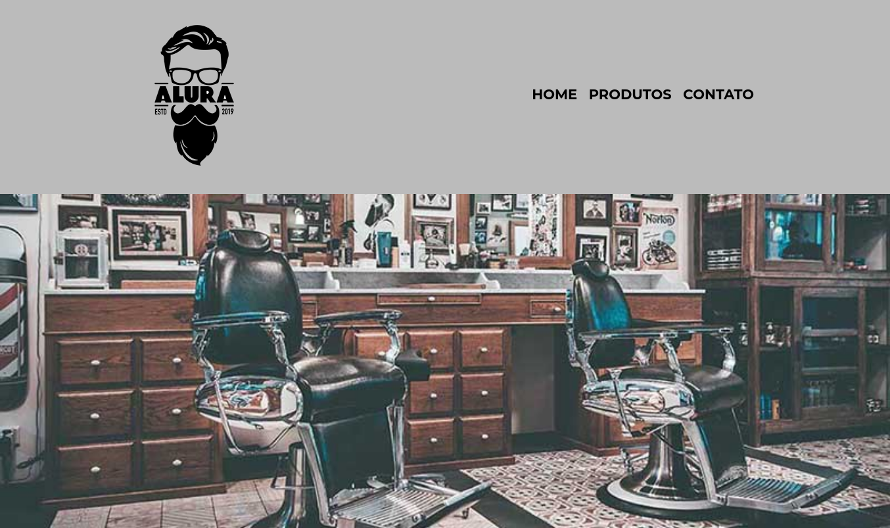
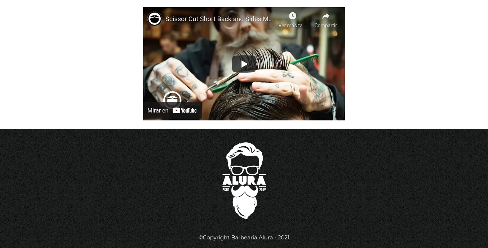

<p align="center">
    <a href="#-projeto">🖥 Projeto</a>&nbsp;&nbsp;&nbsp;|&nbsp;&nbsp;&nbsp;
    <a href="#-tecnologias">👨‍💻 Tecnologias</a>&nbsp;&nbsp;&nbsp;|&nbsp;&nbsp;&nbsp;
    <a href="#-executar-o-projeto">🖇 Execução do Projeto</a>&nbsp;&nbsp;&nbsp;|&nbsp;&nbsp;&nbsp;
    <a href="#-licença">📃 Licença</a>&nbsp;&nbsp;&nbsp;|&nbsp;&nbsp;&nbsp;
    <a href="#-observações">📌 Observações</a>
</p>
<div style="display: flex; flex-direction: row; justify-content: center; align-items: center; flex-wrap: wrap"  align="center">
    
     
    
</div>


## 🖥 Projeto
O Barbearia Alura é um projeto que foi desenvolvido seguindo os cursos de **Html e Css** da Alura. Nesse projeto aplicamos conhecimentos básicos e avançados de html e css e alguns padrões de organização que podemos seguir.

## 👨‍💻 Tecnologias
As tecnologias usadas nesse projeto foram:
- [HTML](https://developer.mozilla.org/en-US/docs/Web/HTML)
- [CSS](https://developer.mozilla.org/en-US/docs/Web/CSS)

## 🖇 Executar o Projeto
Para executar o projeto, apenas é preciso clonar ele em seu dispositivo:

- Clone o repositório
    ```bash
    $ git clone https://github.com/Yta-ux/barbearia_alura.git
    ```

##  📃 Licença
Esse projeto possui licença MIT. Para mais detalhes consulte o arquivo [LICENSE](LICENSE.md)

## 📌 Observações
Esse projeto será modificado de acordo meus estudos em outros cursos mais avançados na plataforma Alura.
